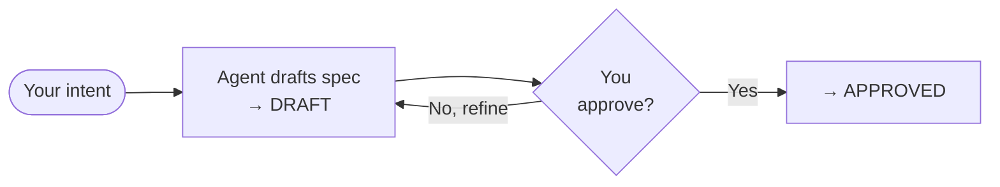
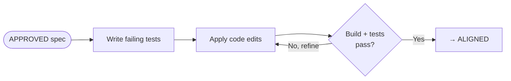
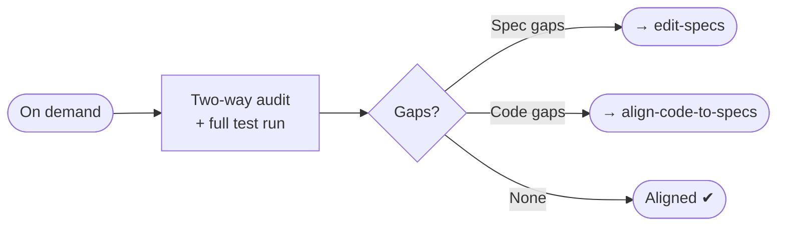

<div align="center">
  <picture>
    <source media="(prefers-color-scheme: dark)" srcset="docs/assets/logo-dark.svg">
    <source media="(prefers-color-scheme: light)" srcset="docs/assets/logo-light.svg">
    
  </picture>
  <h1>HYPERSPEC</h1>
</div>
<div align="center">
  <p>Specs as an absolute, declarative design plane.</p>
  <p>If it's not in the spec, it doesn't exist.</p>
</div>
<p align="center">
    <a href="https://github.com/hyperspec-run/hyperspec/releases/latest"></a>
    <a href="https://github.com/hyperspec-run/hyperspec/stargazers"></a>
    <a href="https://github.com/hyperspec-run/hyperspec/blob/main/LICENSE.md"></a>
</p>

## Table of Contents

- [ℹ️ What is Hyperspec?](#what-is-hyperspec)
- [✨ Core Pillars](#-core-pillars)
- [🚀 Get started](#get-started)
- [🛠 How to use](#how-to-use)
  - [1. Design — `edit-specs`](#1-design--edit-specs)
  - [2. Realign — `align-code-to-specs`](#2-realign--align-code-to-specs)
  - [3. Assess — `assess-alignment` (optional)](#3-assess--assess-alignment-optional)


## ℹ️ What is Hyperspec?

Hyperspec is a declarative, specification-driven framework for **designing products** and harnessing coding agents. It treats the product specification not merely as documentation, but as the single source of truth, and the design plane for the entire product lifecycle.

In a Hyperspec workflow, product design is the primary activity. Code is never edited directly, and agents are never instructed through ad-hoc requests. Instead, the design team or developers refine the product design by updating absolute, declarative specifications. Coding agents then serve as the engine to align the codebase to match this designed state.


## 🌟 Core Pillars

### 1. Spec as the Design Plane
The specifications (`specs`) describe the exact expected state of the product, serving as the blueprint for both product design and engineering. Every design detail, edge case, and business rule is designed within the spec first. If a behavior or design is not in the spec, it does not exist in the product.

### 2. Absolute Declarative Specifications
Specs always describe the *exact target state* of the application. They contain no concept of before/after, steps of modification, or historical changes. Product designers and engineers focus entirely on modeling the perfect end-state of the product. History is maintained solely by version control (e.g., Git history).

### 3. Design-Driven Development
Developers and designers never directly modify code or run ad-hoc agent prompts. Any change to the product begins with a design update in the specifications, which automatically propagates down to the codebase.

### 4. Alignment-Based Workflow
The development cycle follows a strict two-step loop:
1. **Design & Spec Update**: The product's specifications are updated to reflect the newly designed state of the product.
2. **Codebase Alignment**: A coding agent analyzes the changes in the specs (using tools like `git diff`) and aligns the codebase with the updated design.


## 🚀 Get started

To install the agent instructions and skills in your workspace, run the following command from your project root:

### Antigravity

```bash
curl -sSL https://github.com/hyperspec-run/hyperspec/releases/latest/download/agents.tar.gz | tar -xz
```

### GitHub Copilot

```bash
curl -sSL https://github.com/hyperspec-run/hyperspec/releases/latest/download/copilot.tar.gz | tar -xz
```


## 🛠 How to use

You steer Hyperspec by **evolving the specs, never by prompting for code directly**. Agents help on both sides — authoring the specs with you, then aligning the code. Work happens in three stages, each driven by an entrypoint skill.

### 1. Design — `edit-specs`

Describe the intent; the agent helps author and refine the spec against the [spec template](.github/templates/spec-template.md). You review until it's right, then sign off to move it from `DRAFT` to `APPROVED`.



### 2. Realign — `align-code-to-specs`

The agent diffs the approved specs, writes failing tests first, then applies clean code until the build and **all** tests pass — marking each chapter `ALIGNED`.



### 3. Assess — `assess-alignment` *(optional)*

Run on demand for a drift audit. It runs the full test suites and a **two-way** check (spec ➔ code, code ➔ spec), then reports gaps with a recommended plan — changing no code.


