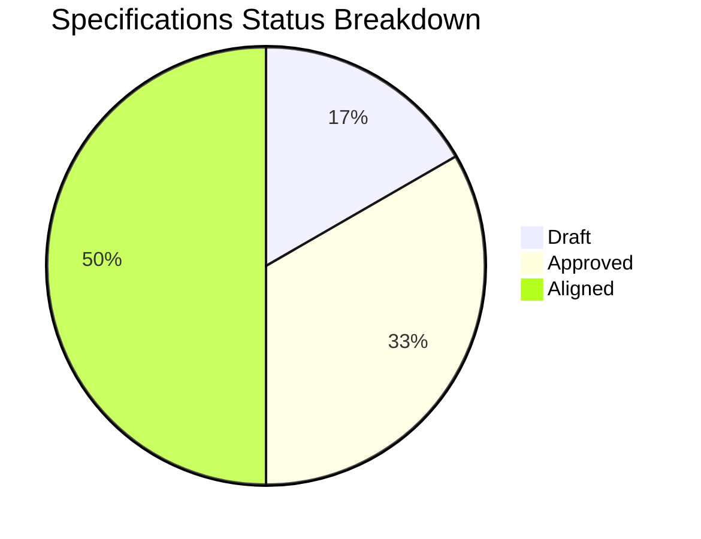
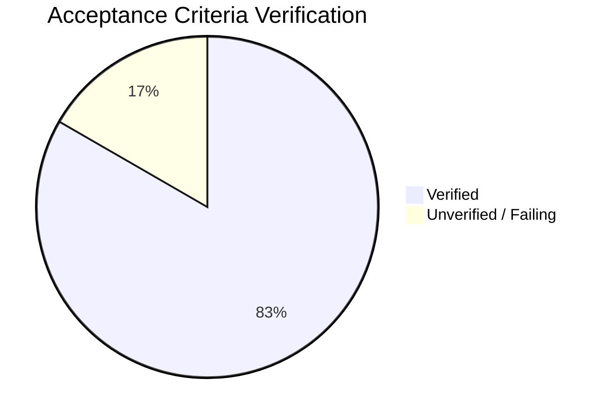

# Alignment Assessment: [Target Component/System Name]

This document contains the two-way alignment assessment report between the codebase and the specifications. The goal of this assessment is purely diagnostic: to identify gaps (items present on one side but missing or mismatched on the other) without performing any modifications to the codebase.

---

## 📊 Summary of Alignment Gaps

| Metric | Total Count | Critical | High | Medium | Low | Notes |
| :--- | :---: | :---: | :---: | :---: | :---: | :--- |
| **Gaps: Spec $\rightarrow$ Code** | [Count] | [Count] | [Count] | [Count] | [Count] | [Brief summary] |
| **Gaps: Code $\rightarrow$ Spec** | [Count] | [Count] | [Count] | [Count] | [Count] | [Brief summary] |
| **Total Mismatches / Gaps** | [Count] | [Count] | [Count] | [Count] | [Count] | |

---

## 📈 Specifications Key Performance Indicators

### Specification Status Breakdown

### Acceptance Criteria Verification

### 1. Specification Completeness & Coverage

| Metric | Target / Value | Notes |
| :--- | :---: | :--- |
| **Total Specifications** | [Count] | Total number of specification files in the repository |
| **Draft Specifications** | [Count] | Specifications in `DRAFT` status |
| **Approved Specifications** | [Count] | Specifications in `APPROVED` status |
| **Aligned Specifications** | [Count] | Specifications in `ALIGNED` status |
| **Aligned Implementation Score** | [Percentage]% | Percentage of active specs that are fully implemented and verified |
| **Leaf Specifications Ratio** | [Percentage]% | Percentage of leaf specifications containing Activable Acceptance Criteria: $\frac{\text{Leaf Specifications}}{\text{Total Specifications}} \times 100$ |
| **Draft-to-Active Ratio** | [Percentage]% | Ratio of draft specifications to active specifications: $\frac{\text{Draft Specifications}}{\text{Approved + Aligned Specifications}} \times 100$ |

### 2. Activable Acceptance Criteria (AAC) Verification

| Metric | Target / Value | Notes |
| :--- | :---: | :--- |
| **Total Acceptance Criteria** | [Count] | Total number of Activable Acceptance Criteria across all specifications |
| **Verified Acceptance Criteria** | [Count] | Activable Acceptance Criteria with passing E2E test |
| **Acceptance Criteria Verification Score** | [Percentage]% | Percentage of verified criteria: $\frac{\text{Verified Acceptance Criteria}}{\text{Total Acceptance Criteria}} \times 100$ |

### 3. Quality, Drift, & Traceability

| Metric | Target / Value | Notes |
| :--- | :---: | :--- |
| **Undocumented Behavior Density** | [Count / LOC] | Number of Code $\rightarrow$ Spec gaps (undocumented behavior) per 1000 LOC |
| **Missing Feature Density** | [Count / Spec] | Number of Spec $\rightarrow$ Code gaps per specification file |
| **Broken Traceability Link Count** | [Count] | Total number of broken bidirectional links between specs and code |

---

## 🔍 Two-Way Audit Details

### 1. Specification against Code (Spec $\rightarrow$ Code)
*Analyze the active specifications and trace them to the codebase to verify implementation status. Identify any requirements, schema rules, behavior/business rules, or acceptance criteria that are defined in the specs but missing or incorrectly implemented in the code.*

- **[ ] Gap ID: SPEC-GAP-01**
  - **Criticality**: `[Low | Medium | High | Critical]`
  - **Spec File & Line**: `[relative/path/to/spec.md#L12]`
  - **Requirement Description**: [e.g., "Verification of validation error when email is duplicate"]
  - **Assessment Findings**: [e.g., "The spec defines AAC-03 for duplicate checking, but no corresponding test or backend validation exists in the codebase."]

- **[ ] Gap ID: SPEC-GAP-02**
  - **Criticality**: `[Low | Medium | High | Critical]`
  - **Spec File & Line**: `[relative/path/to/spec.md#L45]`
  - **Requirement Description**: [e.g., "Transition animation on hover for Submit button"]
  - **Assessment Findings**: [e.g., "The css file is missing the specific transition defined in Section 4 of the spec."]

---

### 2. Code against Specification (Code $\rightarrow$ Spec)
*Analyze the codebase (source code, API routes, data schemas, etc.) to identify logic, features, configuration, or behaviors that are present but not documented or defined in any specification.*

- **[ ] Gap ID: CODE-GAP-01**
  - **Criticality**: `[Low | Medium | High | Critical]`
  - **Code File & Line**: `[relative/path/to/source.rs#L85]`
  - **Code Element / Logic**: [e.g., `fn delete_user_permanently(...)` endpoint/function]
  - **Assessment Findings**: [e.g., "There is a permanent deletion route in the controller and service layer, but the User Management spec only specifies soft-deletes (`is_active = false`). This represents undocumented codebase behavior."]

- **[ ] Gap ID: CODE-GAP-02**
  - **Criticality**: `[Low | Medium | High | Critical]`
  - **Code File & Line**: `[relative/path/to/schema.sql#L14]`
  - **Code Element / Logic**: [e.g., `middle_name` column in `users` table]
  - **Assessment Findings**: [e.g., "The database schema defines a `middle_name` column, but it is not listed in the Data Model section of the spec."]

---

## 🛠️ Verification Execution Log
*Record the commands run during validation (compilation checks, test suites) and their outcomes.*

### Compilation / Build / Lint Checks

| Check / Command | Status | Notes |
| :--- | :---: | :--- |
| `[e.g., cargo check / npm run lint]` | `[PASS / FAIL]` | [Any compile/lint warnings or failures observed] |

### Test Suite Execution

| Test Suite / Command | Status | Total Tests | Passed | Failed | Pass Rate | Notes |
| :--- | :---: | :---: | :---: | :---: | :---: | :--- |
| `[e.g., cargo test / npm test]` | `[PASS / FAIL]` | [Count] | [Count] | [Count] | [Percentage]% | [Details on any failing tests] |

---

## 📋 Recommended Action Plan (Next Steps)
*List the high-level tasks required to resolve the identified gaps (e.g., aligning specs via `edit-specs` skill or aligning code via `align-code-to-specs` skill). Remember: No code changes are to be executed during the assessment phase.*

1. **[ ] Align Specs**: Update specifications to document the following undocumented behaviors:
   - [List items...]
2. **[ ] Align Code**: Implement the missing specifications or remove undocumented code:
   - [List items...]
